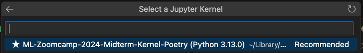

Post Engagement Prediction Project
==============================

This project includes a machine learning scripts for predicting post engagements on Polish social media platform: wykop.pl. The setup allows for easy installation, training, and serving, as well as deploying in a Docker container.

Data Overview
-------------

This dataset contains about user posts (from 2022). Data somes from [Wykop.pl Social Media Data](https://www.kaggle.com/datasets/grelade/wykop-data-2022)
Below are descriptions of the key columns:

- title:	        Title of the post or content.
- description	        Detailed description or summary of the post.
- source_url    	URL linking to the original content.
- upvote_count  	Number of upvotes the post has received.
- downvote_count	Number of downvotes the post has received.
- comments_count	Total number of comments on the post.
- related_count 	Number of related posts or links associated with this post.
- creation_date 	Timestamp indicating when the post was created.
- author_user_id	Unique identifier of the user who created the post.
- plus18        	Indicates if the post is restricted to audiences aged 18+ (e.g., 1 for yes, 0 for no).
- can_vote      	Indicates if voting is allowed on this post (e.g., 1 for yes, 0 for no).
- is_hot        	Boolean flag indicating if the post is currently trending.
- tags          	List of keywords or topics associated with the post.

### Project Goal
The primary goal of this project is to develop a predictive model that can estimate key metrics for social media posts, such as upvote count or engagement levels based on the content’s features. By leveraging machine learning, I aim to understand how factors like titles, descriptions, tags, and posting times influence user engagement.

### Machine Learning Approach
- Data Processing: The data is preprocessed to handle outliers, and standardize or encode features as needed.
- Feature Engineering: Features and categorical encodings for tags may be added to enhance the model's predictive power.
- Model Training and Evaluation
- Model Deployment: The trained model can be served through an API (e.g., using Flask) that takes in new property details and returns a predicted upvote, allowing for integration with applications or websites.

### Expected Outcomes
The project delivers:

- A Prediction API: A simple interface to receive post details and return post upvote estimate.
- Insights into Post Upvotes: Analysis of the data may yield insights on key upvote factors, trends by tags, and other valuable metrics.

Prerequisites
-------------

*   **Python 3.11**
*   **Poetry** (for dependency management)
*   **Docker** (for containerization)
*   **Make** (for running Makefile commands)

Installation
------------

### Option 1: Using the Makefile

The Makefile ([check how to install](#install-make)) provides a streamlined way to install dependencies and manage the environment.

*   **Install testing dependencies** (for Jupyter, matplotlib, etc.):
    
        make start_jupyter
    
*   **Install deployment dependencies** (for running the server):
    
        make server
    

### Option 2: Using Poetry Directly

Ensure that **Poetry** is installed. If not, install it using:

    curl -sSL https://install.python-poetry.org | python3 -

Then, install dependencies with Poetry:

*   **All dependencies** (`RECOMMENDED`):
    
        poetry install

*   **Testing dependencies** (for Jupyter, matplotlib, etc.):
    
        poetry install --with test
    
*   **Deployment dependencies** (for running the server):
    
        poetry install --with deploy
    

### Option 3: Manual Installation with Conda

If you don’t want to use Poetry, you can install the dependencies manually:

    conda create -n machine-learning-zoomcamp-2024-capstone-1 python=3.11
    conda activate machine-learning-zoomcamp-2024-capstone-1
    conda install numpy pandas scikit-learn seaborn jupyter category_encoders lightgbm textblob stopwordsiso

Running Jupyter Notebook
------------------------

### Option 1: Using the Makefile

The `start_jupyter` target will install the testing dependencies and create a Jupyter kernel named "ML-Zoomcamp-2024-Capstone-1-Kernel-Poetry".

    make start_jupyter

### Option 2: Using Poetry Directly

Install testing dependencies and set up the kernel:

    poetry install --with test
    poetry run python -m ipykernel install --user --name=machine-learning-zoomcamp-2024-capstone-1 --display-name "ML-Zoomcamp-2024-Capstone-1-Kernel-Poetry"

## Select the Kernel

Once `Jupyter kernel` is created `ML-Zoomcamp-2024-Capstone-1-Kernel-Poetry`

### in VS Code
- Open VS Code and go to your .ipynb notebook file.
- Click on the kernel selection dropdown in the top right corner of the notebook interface.
- Look for the kernel named `ML-Zoomcamp-2024-Capstone-1-Kernel-Poetry`
- Select this kernel. This will use the environment and dependencies managed by Poetry.

Training the Model
------------------

### Option 1: Using the Makefile
   
        make train

### Option 2: Using Poetry Directly

Alternatively, use Poetry directly to install dependencies and train the model with model type specified:

        poetry install --with test
        poetry run python3 train.py
     

Serving the Model with Flask
----------------------------

The model can be served via Flask, making it accessible for predictions.

### Option 1: Using the Makefile

To serve the model:

    make server

### Option 2: Using Poetry Directly

Install deployment dependencies and run the server:

    poetry install --with deploy
    poetry run python3 predict.py

Once the dependencies are installed and script started, you’ll see a message to open your browser at `http://127.0.0.1:8080` to access the application.    

Using Docker for Containerization
---------------------------------

### Build and Run the Docker Container

1.  **Build the Docker image**:
    
        make container
    
2.  **Run the Docker container** (exposing port 8080):
    
        make run_container

Once the container starts, you’ll see a message to open your browser at `http://localhost:8080` to access the application.

3.  **Stop the Docker container**:
    
        make stop_container  

Using the WebApp to predict the post engagement
---------------------------------
       

#### Post Engagement Input Form
The webview form allows users to interact with the machine learning model by inputting or loading data related to social media posts. Below is a description of the fields and buttons available in the form.

1. Title: A text input field for the post’s title.
2. Description: A text area for adding detailed content or a summary of the post.
3. Tags: Keywords or topics associated with the post. These are entered as a comma-separated list.
4. URL: The link to the original source of the post.
5. Creation Date: Date and time when the post was created.

6. Original Upvote Count: The original number of upvotes for the post.
7. Predicted Upvote Count (Generated Automatically): The predicted number of upvotes for the post. This field is updated after the prediction.

#### Buttons: 
- Load Random Post Data: this button generates a random post (from test dataset) and fills the form with data for that post.
- Predict the Outcome: submits the current form data along with any preloaded data to the machine learning model for prediction.

#### Summary of Functionality:
- Generate Random Post: Populate the form with random data for testing.
- Predict Outcome: Submit the filled form to get the predicted upvote count for the post.

After filling in the form, the user clicks the Predict the Outcome button to get a prediction based on the post details.

Test the model online
---------------------------------

Alternatively, model and test form is avarialbe online for tests:
https://post-engagement-latest.onrender.com/

How to
---------------------------------

### Install Make
#### On Linux
- `make` is usually pre-installed on most Linux distributions.
- If not, you can install it via the package manager:
        - Debian/Ubuntu: `sudo apt install make`
        - Fedora/RHEL/CentOS: `sudo dnf install make` (or `yum` on older versions)
#### On macOS
- `make` is generally included with the Xcode Command Line Tools.
- If it’s missing, install Xcode Command Line Tools by running:        
    
        xcode-select --install

#### On Windows
- Make is not natively available on Windows.
- Options for installing make on Windows include:
  - Git Bash: Install Git for Windows, which includes Git Bash and comes with make. You can run make from Git Bash.
  - Chocolatey: If you use Chocolatey, you can install make with:
            
        choco install make

  - WSL (Windows Subsystem for Linux): Installing WSL allows you to run a Linux environment on Windows, where make can be installed as usual.

After installation, you can verify that make is accessible by running:

        make --version